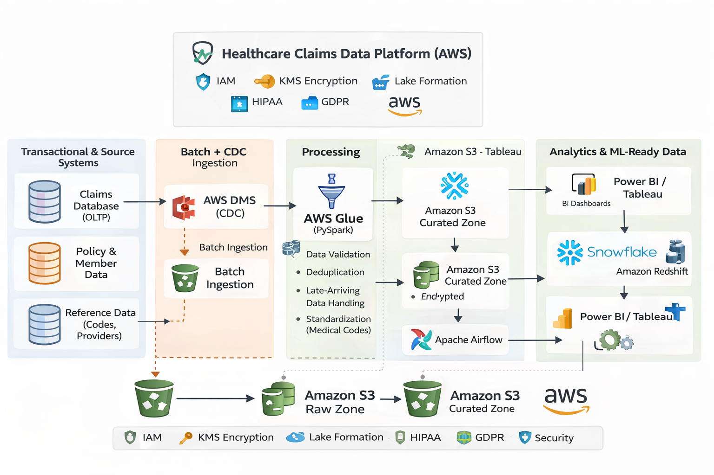

# Data Engineer Portfolio

End-to-end data engineering projects showcasing scalable data pipelines, architecture diagrams, and analytics-ready datasets using AWS, Apache Spark, Python, and SQL.

---

## 👋 About Me

Hi! I'm Pawan Yandapalli — a Data Engineer with strong hands-on experience building data platforms and pipelines on AWS using Python, SQL, and Spark. I specialize in transforming raw data into structured, high-quality datasets optimized for analytics and machine learning use cases.

My focus areas include:
- Batch and CDC ingestion pipelines  
- Data modeling and data quality validation  
- Cloud-native architectures (AWS)  
- Analytics and ML-ready data  
- Documentation with architecture diagrams and best practices

---

## 🛠 Skills

**Languages:** Python, SQL, PySpark  
**Big Data:** Apache Spark, AWS Glue, Airflow, DBT  
**Cloud (AWS):** S3, Glue, Redshift, EMR, Lambda, EventBridge, IAM  
**Databases & Warehouses:** Snowflake, Amazon Redshift, PostgreSQL  
**Data Modeling:** OLTP, OLAP, Star Schema  
**DevOps:** Docker, Terraform, CI/CD  
**BI & Visualization:** Power BI, Tableau  
**Governance:** HIPAA, GDPR (data handling exposure)

---

## 📌 Portfolio Projects

### 🩺 Healthcare Claims Data Platform (AWS)

- Built an end-to-end data pipeline to ingest, process, and curate healthcare insurance claims data  
- Designed CDC (Change Data Capture) ingestion and batch workflows  
- Implemented data quality checks and late-arriving data handling  
- Produced analytics-ready datasets used for BI and ML pipelines

**Tech Stack:** AWS S3, AWS Glue, PySpark, Snowflake, Airflow

#### Architecture Diagram



---

### 🔄 Change Data Capture (CDC) Pipeline

- Designed a CDC pipeline capturing incremental changes from a transactional database  
- Ensured idempotent loads, deduplication, and historical record preservation  
- Optimized Spark jobs to scale with large data volumes

**Tech Stack:** PostgreSQL, AWS DMS, S3, PySpark, Snowflake

---

### ⚡ Event-Driven Data Processing

- Built an event-driven pipeline triggered by object uploads to S3  
- Automated near real-time transformation jobs using Lambda and Glue  
- Enhanced system responsiveness and reduced latency

**Tech Stack:** AWS S3, EventBridge, Lambda, Glue

---

## 📂 Repository Structure
## 📂 Repository Structure

```text
data-engineer-portfolio/
│
├── 01_sql/
├── 02_python/
├── 03_spark_pyspark/
├── 04_cloud_aws/
│   └── architecture_diagrams/
├── 05_end_to_end_projects/
├── 06_devops/
└── datasets/
