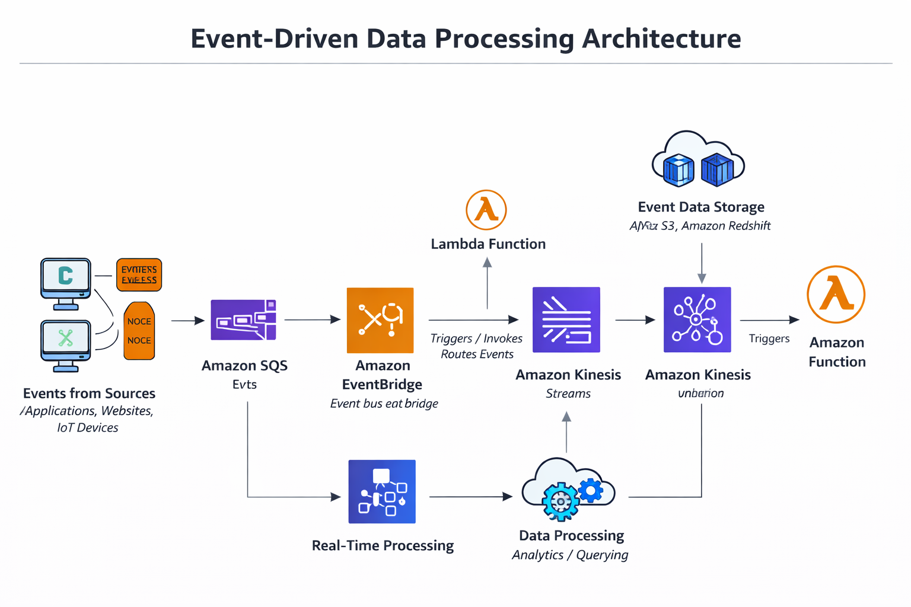

# Data Engineer Portfolio

End-to-end data engineering projects demonstrating scalable data pipelines,
cloud-native architectures, and analytics-ready datasets built using
AWS, Apache Spark, Python, and SQL.

---

## 👋 About Me

Hi! I'm **Pawan Yandapalli**, a Data Engineer with strong hands-on experience
building data platforms and production-grade data pipelines on AWS.
I specialize in transforming raw data into reliable, high-quality datasets
optimized for analytics and machine learning use cases.

My core focus areas include:
- Batch and CDC (Change Data Capture) ingestion pipelines  
- Data modeling and data quality validation  
- Cloud-native data architectures (AWS)  
- Analytics- and ML-ready data design  
- Clear, production-style documentation with architecture diagrams  

---

## 🛠 Skills

**Languages:** Python, SQL, PySpark  
**Big Data & Processing:** Apache Spark, AWS Glue, Airflow, dbt  
**Cloud (AWS):** S3, Glue, Redshift, EMR, Lambda, EventBridge, IAM  
**Databases & Warehouses:** Snowflake, Amazon Redshift, PostgreSQL  
**Data Modeling:** OLTP, OLAP, Star Schema  
**DevOps:** Docker, Terraform, CI/CD  
**BI & Visualization:** Power BI, Tableau  
**Governance & Compliance:** HIPAA, GDPR (data handling exposure)

---

## 📌 Portfolio Projects

### 🩺 Healthcare Claims Data Platform (AWS)

- Built an end-to-end data platform to ingest, process, and curate healthcare
  insurance claims data  
- Designed both batch and CDC ingestion workflows  
- Implemented data quality checks and late-arriving data handling  
- Produced analytics-ready datasets consumed by BI dashboards and ML pipelines  

**Tech Stack:** AWS S3, AWS Glue, PySpark, Snowflake, Airflow  

📁 Code: `05_end_to_end_projects/healthcare_claims_pipeline`

#### Architecture Diagram


---

### 🔄 Change Data Capture (CDC) Pipeline

- Designed a CDC pipeline to capture incremental changes from a transactional database  
- Ensured idempotent loads, deduplication, and historical record preservation  
- Optimized Spark jobs to scale efficiently with large data volumes  

**Tech Stack:** PostgreSQL, AWS DMS, S3, PySpark, Snowflake  

📁 Code: `05_end_to_end_projects/cdc_pipeline`

---

### ⚡ Event-Driven Data Processing Pipeline (AWS)

- Built an event-driven data pipeline triggered by object uploads to Amazon S3  
- Automated near real-time transformations using AWS Lambda and AWS Glue  
- Improved system responsiveness and reduced end-to-end processing latency  

**Tech Stack:** AWS S3, EventBridge, Lambda, Glue  

📁 Code: `04_cloud_aws/glue_lambda_samples`

#### Architecture Diagram



---

## 📂 Repository Structure

This repository is organized to mirror real-world data engineering workflows,
from analytics development to production pipelines and platform infrastructure.

```text
data-engineer-portfolio/
│
├── 01_sql/                  # Advanced SQL analytics and window function use cases
├── 02_python/               # Reusable Python data processing utilities with tests
├── 03_spark_pyspark/        # Spark transformations, performance optimization, and data quality
├── 04_cloud_aws/            # AWS Glue, Lambda samples, and architecture diagrams
│   └── architecture_diagrams/
├── 05_end_to_end_projects/  # Production-style CDC and batch pipelines
├── 06_devops/               # Docker, CI/CD, and Infrastructure as Code (Terraform)
└── datasets/                # Sample datasets used across projects
```
### 📫 Contact

LinkedIn: https://www.linkedin.com/in/pawanyandapalli/

Email: pawanyandapalli7@gmail.com
